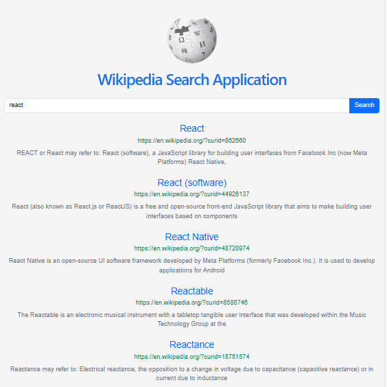

# Wikipedia Search Application

A React-based Wikipedia Search Application that allows users to search Wikipedia articles using the CCBP Wikipedia Search API.

## 🚀 Live Demo

https://wikipedia-search-react-sage.vercel.app/

## 📂 GitHub Repository

https://github.com/chepuribhargavi/wikipedia-search-react

## 📸 Project Preview



## ✨ Features

- Search Wikipedia articles instantly
- Displays article title, URL, and description
- Loading spinner while fetching data
- Responsive design using Bootstrap
- Opens articles in a new browser tab

## 🛠️ Technologies Used

- React
- JavaScript (ES6+)
- Bootstrap
- HTML
- CSS
- Fetch API

## ⚙️ Installation

Clone the repository:

```bash
git clone https://github.com/chepuribhargavi/wikipedia-search-react.git
```

Go to the project folder:

```bash
cd wikipedia-search-react
```

Install dependencies:

```bash
npm install
```

Run the project:

```bash
npm run dev
```

## 👩‍💻 Author

**Chepuri Bhargavi**

GitHub: https://github.com/chepuribhargavi
